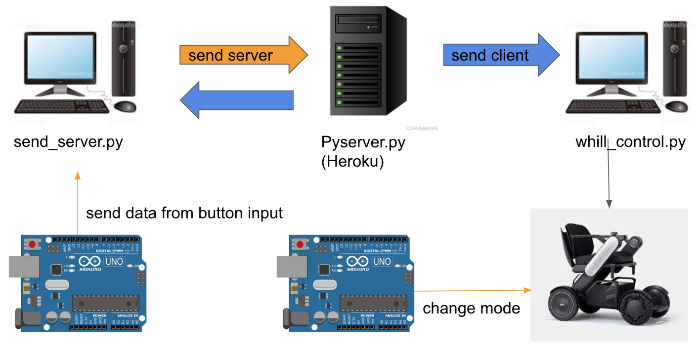

# remote-WHILL-control

This project enable you to control WHILL remotely by websocket

* This project use arduino as input but not include arduino code 

* send: send data to server from arduino button inputs
* server: connect clients and receive and send data (you can try local or heroku)
* whill_control: receive data from server and move WHILL(need to connect WHILL and arduino)
  
  